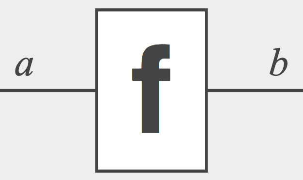
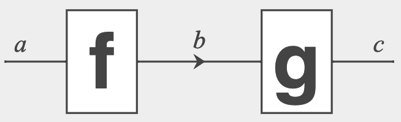
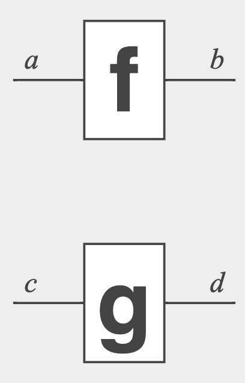
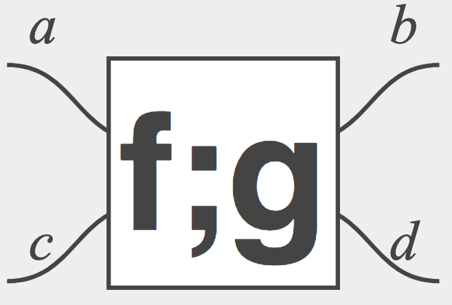
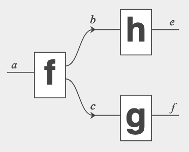
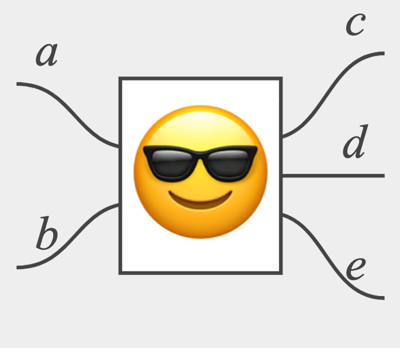
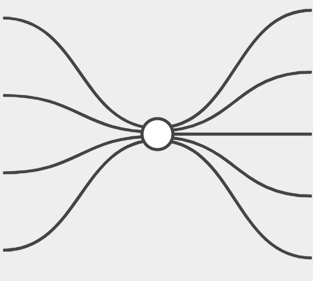

# Exchange format for morphisms in Monoidal Categories

> Date: 18-2-2020 <br>
> Status: *draft specification*

This document attempts to describe a interchange format for morphisms of monoidal categories.

## Motivation

Categories are algebraic structures that allow you to "compose" *maps* (also called *morphisms*).

A *map* is a thing with a certain *source* and *target* type (called *domain* and *co-domain*). This can be graphically depicted as a box with *input* and *output* wires.



Composing a map is only possible if the *target* of one map is the *source* of the other. Graphically:



*Monoidal* categories (also called *tensor categories*) are categories with an additional way of combining morphisms, called the *tensor* product. Instead of composing in sequence we compose "in parallel". Graphically this amounts to putting boxes next to eachother.



Which itself can be interpreted as a box with two in and two outgoing wires.



There is *no meaning assigned to the boxes*!

This is on purpose. By seperating the *semantics* from the *syntax*, monoidal categories become a useful language to describe *many different systems*, all of them using the same base language of boxes and wires.

There are many different flavours of monoidal category (syntax): braided, symmetric, etc.

We don't attempt to capture each such category out there, but this draft specification is an attempt to address some of the most commonly used monoidal categories.

## Example

Consider this string diagram.



This could be represented as a term,

    f ; (h * g)

(`;` is actually called "compose")

In this format, that would be represented as.

```json
{
	"type": "compose",
	"terms": [{
		"type": "generator",
		"outputTypes": ["b", "c"],
		"name": "f",
		"inputTypes": ["a"]
	}, {
		"type": "tensor",
		"terms": [{
			"type": "generator",
			"outputTypes": ["e"],
			"name": "h",
			"inputTypes": ["b"]
		}, {
			"type": "generator",
			"outputTypes": ["f"],
			"name": "g",
			"inputTypes": ["c"]
		}]
	}]
}
```

## Combinators

We have `compose` and `tensor`. Compose works in semicolon order.

The `terms[]` array should contain at least two terms.

## Terms

### Generator / Box 📦

A box has a *name* (can be any unicode string, also emoji's of course), *domain* and *codomain*.



```json
{
	"type": "generator",
	"outputTypes": ["c", "d", "e"],
	"name": "😎",
	"inputTypes": ["a", "b"]
}
```

### Tensor

- [ ] TODO

### Compose

- [ ] TODO

### Spiders 🕷️

In certain cases the is a unique morphism from `X^n -> X^m`, which is rendered as a dot with `n` in and `m` outgoing "legs".



```json
{
	"typeParam": "α",
	"type": "spider",
	"outputs": 5,
	"name": "g",
	"inputs": 4,
	"color": "white"
}
```

### Cups/Caps 🏆/🧢

```json
{
  "typeParam":"α*",
  "type":"cup",
  "name":"("
}
```

### Identities & Permutations

- [ ] TODO

## Syntax

```
root ::= term
term ::= unit | tensor | identity | compose | generator | permutation | spider | cup | cap

type ::= string

unit ::= 
  { "type": "unit"
  , "inputTypes": type[]
  , "outputTypes": type[] 
  }

tensor ::= 
  { "type": "tensor"
  , "terms": term[]
  , "inputTypes": type[]
  , "outputTypes": type[] 
  }

identity ::= 
  { "type": "identity"
  , "inputTypes": type[]
  , "outputTypes": type[] 
  }

compose ::= 
  { "type": "compose"
  , "terms": term[]
  , "inputTypes": type[]
  , "outputTypes": type[] 
  }

generator ::=
  { "type": "generator"
  , "name": string
  , "inputTypes": type[]
  , "outputTypes": type[] 
  }

permutation ::=
  { "type": "permutation"
  , "name": string,
  , "permutation": number[]
  , "inputTypes": type[]
  , "outputTypes": type[] 
  }

spider ::=
  { "type": "spider"
  , "name": string
  , "inputs": number
  , "outputs": number
  , "color": "white" | "black"
  , "typeParam": type
  , "inputTypes": type[]
  , "outputTypes": type[] 
  }

cup ::=
  { "type": "cup"
  , "name": string
  , "typeParam": type
  , "inputTypes": type[]
  , "outputTypes": type[] 
  }

cap ::=
  { "type": "cap"
  , "name": string
  , "typeParam": type
  , "inputTypes": type[]
  , "outputTypes": type[] 
  }
```
